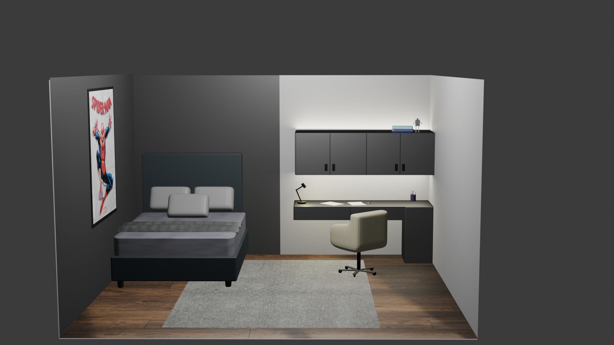

# 🏠 Modern Minimalist Bedroom Design

Bu proje, **Blender** kullanılarak modellenmiş ve render alınmış, izometrik bakış açısına sahip modern bir yatak odası tasarımıdır.

## 🌟 Proje Hakkında

Bu çalışmada, hem çalışma hem de dinlenme alanlarını içeren kompakt bir oda tasarlanmıştır. Tasarımda modern mobilyalar, ahşap zemin dokusu ve karakter katan dekoratif öğeler kullanılmıştır.

### Öne Çıkan Özellikler:
* **Mobilya:** Yatak, çalışma sandalyesi, masa ve dolap modellemeleri.
* **Aydınlatma:** Ortam ışıklandırması ve LED detayları.
* **Kompozisyon:** İzometrik kamera açısı ve mekan tasarımı.

## 🛠️ Kullanılan Teknolojiler

* **Yazılım:** Blender
* **Render Motoru:** Cycles / Eevee (Kullandığını buraya yazabilirsin)

## 📂 Dosya Yapısı

Proje dosyaları aşağıdaki gibidir:

* `odatasarimi.blend`: Projenin ana kaynak dosyası (Bunu açarak düzenleyebilirsiniz).
* `render.jpg`: Odanın alınmış son render görüntüsü.
* `final.blend11`: Blender tarafından oluşturulan yedekleme/versiyon dosyası.
* `.gitattributes`: Git LFS ve dosya nitelik ayarları.

## 🚀 Kurulum ve Kullanım

Projeyi bilgisayarınızda görüntülemek için:

1.  Bu repoyu klonlayın veya indirin.
2.  Bilgisayarınızda **Blender**'ın yüklü olduğundan emin olun.
3.  **`odatasarimi.blend`** dosyasını çift tıklayarak açın.
4.  Render almak için `F12` tuşuna basın.

## 📝 Lisans

Bu proje MIT lisansı altındadır.

---
**Geliştirici:** [Adın Soyadın]
